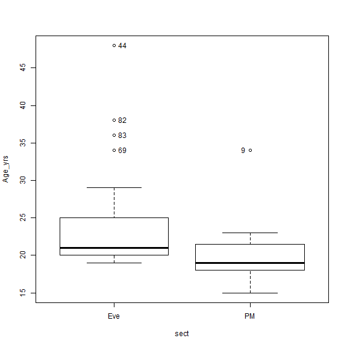

<!-- R Commander Markdown Template -->

Replace with Main Title
=======================

### Your Name

### 2018-10-08


```r
> alldat <- read.table("E:/Project_folders/Class_Survey/alldat.csv", header=TRUE, 
+   sep=",", na.strings="NA", dec=".", strip.white=TRUE)
```


```r
> Boxplot(Age_yrs~sect, data=alldat, id=list(method="y"))
```



```
[1] "44" "69" "82" "83" "9" 
```


```r
> library(abind, pos=36)
```


```r
> library(e1071, pos=37)
```


```r
> numSummary(alldat[,"Age_yrs", drop=FALSE], groups=alldat$sect, 
+   statistics=c("mean", "sd", "IQR", "quantiles"), quantiles=c(0,.25,.5,.75,1))
```

```
        mean       sd  IQR 0% 25% 50%   75% 100% Age_yrs:n Age_yrs:NA
Eve 24.14815 7.150598 5.00 19  20  21 25.00   48        27         15
PM  19.91667 3.549852 3.25 15  18  19 21.25   34        24         17
```


```r
> t.test(Age_yrs~sect, alternative='two.sided', conf.level=.95, var.equal=FALSE, 
+   data=alldat)
```

```

	Welch Two Sample t-test

data:  Age_yrs by sect
t = 2.7208, df = 39.025, p-value = 0.009678
alternative hypothesis: true difference in means is not equal to 0
95 percent confidence interval:
 1.085755 7.377208
sample estimates:
mean in group Eve  mean in group PM 
         24.14815          19.91667 
```


